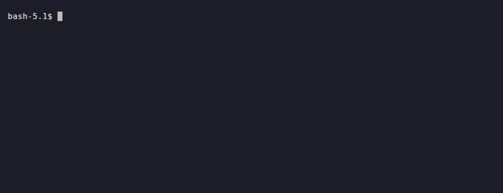

# reactifact

**Auditable agents for Python.** Build **knowledge assistants** over docs,
spreadsheets and the web — where the path per question isn't a graph you can
draw. Every answer is computed, versioned and reproducible — not a string you
have to trust.

> **Is:** a Python library (3 core deps) · single-process · typed, versioned
> artifacts with provenance · deterministic replay · runs offline, no API key
> **Isn't:** a managed platform · a distributed task queue · a pre-built
> agent/tool marketplace

A question like *"why did infra costs jump in Q2?"* needs a spreadsheet, a policy
doc and a page off the web — and the *next* question needs a different subset.
That is not one graph you can draw up front. You declare what artifacts exist and
what agents can do with them; the runtime derives the order from state. Every
derived artifact then links to what produced it
(`Answer —supported_by→ Evidence —extracted_from→ Doc`), so *"why did it say
that?"* is a query, not a guess — and the run is reproducible (`context_hash`)
and verifiable (`reactifact replay --verify`).

<details>
<summary><strong>If you know Celery…</strong> — the programming model, not its distributed runtime</summary>

Python developers already know this model from Celery: define a **task**, declare
what triggers it, let the runtime run it. `reactifact` applies it to agents: a
task reacts to a **typed, versioned artifact** in the context, not to a queued
message or a graph edge.

| Celery | reactifact |
| --- | --- |
| a task | `@produce(Model)` — a unit of work that writes an artifact |
| `delay()` / `apply_async()` | you don't call it: creating the input artifact **is** the trigger |
| routing key / queue | `Consume(Type)` — which artifact type wakes the task |
| chain / group / chord | several `consumes` / `produces`; the runtime derives the order |
| result backend | the `Context` — typed, versioned artifacts |
| worker | `Runtime` |

**Not inherited:** a broker, a worker pool, `acks_late`/redelivery, cross-process
exactly-once — the *model* is Celery-shaped, the deployment is not.

</details>

## On top: a provable answer

[`examples/fintech_audit`](../../examples/fintech_audit) — a transactions CSV, a
budget CSV and a policy doc, **no API key**. The model never computes the number;
plain Python does, and the answer is linked to its evidence:

```text
variance vs budget: +12.5%   ($45,000 actual vs $40,000 budget, 10% policy threshold → over)
answer sha256 5461290d…  ·  context sha256 24449f6f…

re-running the pipeline hashes identically — or verify a saved run:
  reactifact replay <store> --session <id> --verify 24449f6f…
```



## How it works

```text
                                   EVENT (created/updated)
                                          │
                                          ▼
CONTEXT ───────► ARTIFACTS ──► AGENTS REACT ──self.effects──► EFFECTS
   ▲                 │                                            │
   │                 │                                            │  compile
   └────── CONTEXT' ◄────────────────┘ PATCH ◄────────────────────┘
```

You describe *what data exists*, *what artifacts exist*, and *what agents can do
with them*. The runtime does the plumbing.

## The mental model

| Traditional agent | reactifact |
| --- | --- |
| A program follows a graph / plan | Agents **react** to state changes |
| Messages are strings | **Typed artifacts** (`Claim`, `Evidence`, `Answer`, …) |
| Orchestration is explicit | Orchestration **falls out of the state** |
| A unit of work *returns* a change | A produce **writes effects** (`self.effects`) — the runtime compiles them |
| Retries/rollback are manual | Context is **versioned** (git-like commits, diff, rollback) |
| "Who produced this?" is lost | **Provenance** links every derived artifact to its inputs |

## Why effects instead of "return a change"?

At the heart of the loop is how a produce makes a change. Many frameworks ask a
unit of work to *return* its result, and some orchestrator applies it. reactifact
inverts authorship: a produce **states what should change** via `self.effects`
(create / update / link / ask) and returns `None`; the runtime compiles the
effect set into one atomic patch — the whole step lands (or none of it does).

```python
async def produce(self, call: ProduceCall) -> None:
    evidence = self.effects.create(Evidence(...), id="evidence:q1")
    answer = self.effects.create(Answer(...), id="answer:q1")
    evidence.link("extracted_from", doc)
    answer.link("supported_by", evidence)
    self.effects.update(turn, status="answered")
    return None
```

Because handles are objects, not ids, one statement can reference the artifact
created by another — and because the runtime owns the compilation, you never
assemble a `Patch` by hand. Human-in-the-loop is just another effect
(`effects.ask(...)`). See [Why reactifact](why-reactifact.md) for the full argument,
and [The produce contract](effects.md) for details.

## Why artifacts instead of messages?

Messages are opaque; artifacts are inspectable. An `Evidence` object knows its
text, its source, and its score. Because every artifact carries provenance, the
runtime can answer *"why did the agent say that?"* by walking the links
`Answer —supported_by→ Claim —derived_from→ Evidence —extracted_from→ Doc`.

## Why versioned context?

Every run is a commit. That gives you:

- **Diff** — exactly what changed between two turns.
- **Rollback** — undo a bad step and re-run from a clean state.
- **Deterministic replays** — the same history reproduces the same result.
- **Inspectability** — a full, queryable history of everything that happened.

## Requires

- Python 3.11–3.14 (`.venv` is managed by `uv`; CI runs the full suite on all four).
- `pydantic` for artifact models; FastAPI/uvicorn only for the web demos.

## Quick start

Two agents, no graph edge declared between them — the second reacts because the
first one's output exists, and the answer carries *proof* of where it came from:

```python
from pydantic import BaseModel

from reactifact import Budget, Consume, Context, Runtime, RuntimeResources, create_agent, produce


class Question(BaseModel):
    text: str


class Evidence(BaseModel):
    text: str


class Answer(BaseModel):
    text: str


DOCS = {
    "refund": "Refunds are available within 14 days of purchase.",
    "pricing": "The Pro plan is $49/month, billed annually.",
}


@produce(Evidence)
async def find_evidence(call):
    question = next((a for a in call.inputs if isinstance(a.data, Question)), None)
    if question is None:
        return None
    hit = next((v for k, v in DOCS.items() if k in question.data.text.lower()), None)
    if hit is not None:
        call.effects.create(Evidence(text=hit))


@produce(Answer)
async def answer_from_evidence(call):
    evidence = next((a for a in call.inputs if isinstance(a.data, Evidence)), None)
    if evidence is None:
        return None
    call.effects.create(Answer(text=evidence.data.text)).link("supported_by", evidence)


search_agent = create_agent("search", consumes=[Consume(Question)], produces=[find_evidence])
answer_agent = create_agent("answer", consumes=[Consume(Evidence)], produces=[answer_from_evidence])

ctx = Context(resources=RuntimeResources())
runtime = Runtime(ctx, agents=[search_agent, answer_agent], budget=Budget(max_runs=10))

ctx.create(Question(text="what's your refund policy?"))
runtime.run()  # search_agent and answer_agent both react — nobody wired them together

answer = ctx.latest(Answer)
evidence = ctx.related(answer.id, "supported_by")[0]
print(answer.data.text)                     # "Refunds are available within 14 days of purchase."
print("supported_by:", evidence.data.text)  # provenance you can trace, not just a string in a log
```

That is the whole loop: **create an artifact → agents react → a patch is applied
→ the context version advances**. Everything else in this documentation builds
on that loop.

Ready for something closer to a real app? [Quickstart](quickstart.md) has
three runnable, verified snippets — a tool-calling agent, retrieval over your
own docs, a session-persisted chat bot — each pointing at the full example
it's trimmed from.

## Where to go next

**Understand the idea**

- [Why reactifact](why-reactifact.md) — the *design argument*: why effects, why no
  graph, why determinism, why versioned state.
- [Comparison](comparison.md) — reactifact vs LangGraph/CrewAI, feature by
  feature, and when *not* to use reactifact.
- [Concepts](concepts.md) — Context, Artifact, Patch, Agent, Produce.

**Build with it**

- [Quickstart](quickstart.md) — three runnable snippets: tool-calling agent,
  retrieval over your docs, session-persisted chat bot.
- [Sources](sources.md) — where agents get information from.
- [Providers](providers.md) — wiring an LLM/embedder/image/speech provider
  into `RuntimeResources`.
- [Recipes](recipes.md) — ready-made search fan-out, ref materialization,
  lifecycle state machines.
- [Patterns](patterns.md) — reusable shapes (reflection, map-reduce,
  supervisor, …), each backed by a concrete example.

**Operate it**

- [Observability](observability.md) — every run traces agent spans,
  reads/writes, LLM calls; offline dashboard, or ship to Langfuse/Postgres.
- [Durability & resume](durability.md) — a session-backed run survives a
  process restart; what "at-least-once" means and how to make produces
  idempotent.
- [Troubleshooting](troubleshooting.md) — "my agent didn't run" / "ran twice" /
  "the run stopped early" — organized by symptom, not by feature.
- [Evaluation](eval.md) — multi-level scoring over the final `Context`
  (evidence quality, provenance grounding, calculation correctness, …).
- [Branching & merge](branching.md) — fork state, explore alternatives,
  three-way merge with explicit conflicts.
- [Replay](replay.md) — reconstruct *why* the agent answered, deterministically,
  without re-running agents.
- [Visualization & CLI](viz.md) — Mermaid diagrams of the artifact graph and
  a run's trace; the `reactifact` command-line tools.
- [API reference](api.md) — every top-level symbol, one line each.

**See it run**

- [Examples](examples.md) — fourteen working applications you can run.
- [Port matrix](port-matrix.md) — which classic LangGraph/CrewAI/DSPy pattern
  maps to which example.
- [Design notes](design-notes/adaptive.md) — deeper rationale for the
  adaptive [scheduler](design-notes/adaptive.md) and the
  [effects → Patch](design-notes/patches.md) compilation model.