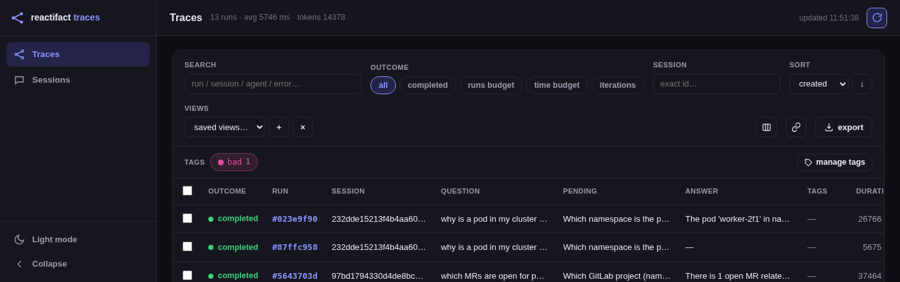
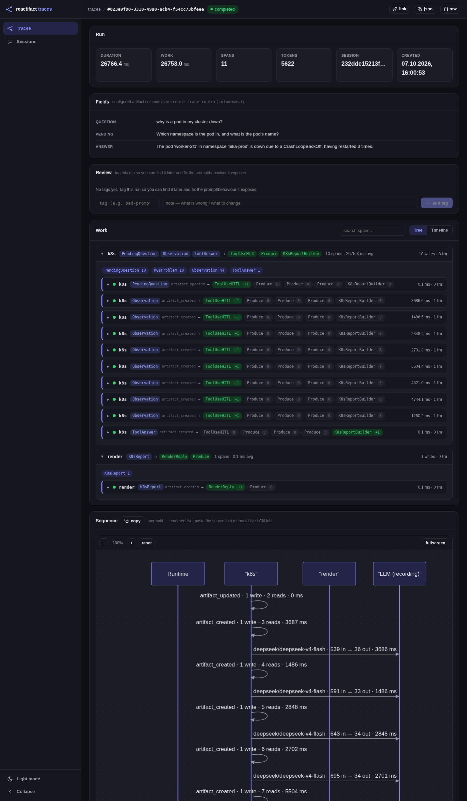

# Observability

Every run records a trace. Traces are *observable by default*: the demo
dashboards work offline with no external services, and you can additionally ship
traces to Langfuse or Postgres.

## What a trace contains

A `RunTrace` is one run of the runtime (until `astream`/`run` ends):

- **Agent spans** (`AgentSpan`) — what each agent did: artifact reads and
  writes, the key/value summary of the patch it produced, the consumed artifact
  type that triggered it (`event_artifact_type`) and which produces actually ran
  (`produces`: name, authored operations, latency).
- **LLM calls** (`LLMCall`) — prompts, responses (truncated), token usage,
  latency.
- **Timing and ordering** — the whole causal chain of a run, in order.

`RecordingLLM` wraps your provider for free, so **LLM call tracking needs no
code** — just wire it at resources time.

## Storing and viewing

### SQLite store + web dashboard (local, offline)

```python
from reactifact.tracing import TraceStore

store = TraceStore("traces.db")   # SQLite sink; also serves runs back to the UI
```

The store's interface is async (`export`/`query`/`get`); the SQLite core runs in
a worker thread, so the same object works in a web app and in plain sync code.

The dashboard is a FastAPI router mounted on your app:

```python
from reactifact.tracing.web import create_trace_router

app.include_router(create_trace_router(store), prefix="/traces")
```

It serves a small app shell (shared `templates/app.css`): a collapsible sidebar
(Traces / Sessions), `/traces` (list of runs, filterable), `/traces/{id}` (stat
tiles, spans, reads, writes, LLM input/output, timing, plus two live Mermaid
diagrams — the run's **sequence** and its **evidence graph**, i.e. written
artifacts with `patch.link` provenance edges, §34), and `/sessions`. The
`devops` example mounts this router and is the reference UI.



Opening a run shows work grouped by agent (span count, artifact types touched,
and a `Consume → Produce` flow: the artifact type that triggered the agent, then
which produce ran with its authored-operation count — no-op produces dimmed) and
the full sequence diagram — here the `devops` example's HITL ask/resume flow:
`k8s` calls the model across several `artifact_created` spans, then `render`
builds the final reply:



### Reviewing runs: tags and notes

The dashboard is also the **review surface**. After inspecting a trace you mark
the run with a tag (`bad-prompt`, `hallucination`, `needs-review`, …) and an
optional note describing what is wrong / what to change. Tags live in the store,
not in the runtime — they are annotations attached to a `run_id` *after* the
fact, so the immutable trace the runtime produced is never rewritten.

- The list page shows tag facets with counts (click to filter), tag chips per
  run, free-text search (run / session / agent / error), sortable columns
  (click a header), token and latency rollups, a live toggle and a JSON export
  of the current filter. Every filter/tag/sort/page lives in the URL, so a view
  is a **shareable link**; name one and it is kept as a **saved view**.
- A **sessions** page (`/sessions`) groups runs by `session_id` with run count,
  total duration, tokens and last-seen, and links into the filtered trace list.
- The run page has a **Review** card: add/remove tags, each with a note.
- **Tree ↔ Timeline**: the run's work is shown either grouped by agent, or as a
  Gantt timeline of spans (start offset + width by latency) that makes
  parallelism and the latency bottleneck obvious.
- In-trace search filters spans/agents/LLM text; **copy link**, **copy JSON**
  and a raw **JSON** view are one click away.
- Select several runs to tag or untag them in bulk.
- `manage tags` renames, recolours or deletes a tag across every run.

```text
GET    /api/traces?tag=bad-prompt&tag=review&tag_mode=all&q=refund&sort=duration_ms
GET    /api/tags                       # facets: name, colour, count
POST   /api/traces/{id}/tags           # {tag, note}
DELETE /api/traces/{id}/tags/{tag}
POST   /api/traces/tags                # bulk: {run_ids, tag, note}
POST   /api/traces/tags/remove         # bulk: {run_ids, tag}
PATCH  /api/tags/{name}                # {new_name, color}
DELETE /api/tags/{name}
GET    /api/traces/export              # full traces for the current filter
GET    /api/sessions                   # runs grouped by session, with rollups
```

Both backends implement the same annotation API: SQLite keeps `tags`/`run_tags`
tables (created and migrated automatically), Postgres mirrors them as
`TEXT`/`TIMESTAMPTZ` with cascading deletes. Point `create_trace_router` at
either and the review workflow behaves identically.

### Configurable columns from artifacts

Give the traces table columns pulled from the run's artifacts — e.g. the user's
question and the final answer:

```python
from reactifact.tracing import TraceColumn

app.include_router(create_trace_router(
    store,
    columns=[
        TraceColumn(label="Question", agent="route", type=UserMsg,
                    field="text", direction="read"),
        TraceColumn(label="Answer", type=ChatReply, field="text"),
    ],
))
```

A `TraceColumn` names the column and where its value comes from: which agent's
span, which artifact `type` (a class or its name), `direction` (`read` / `write`
/ `any`), and a dotted `field` into the artifact's data. A list step takes its
first element unless an explicit index is given, so `sources.title` means
`sources[0].title` and `sources.1.title` the second. Several matches: `index`
defaults to the last. A missing artifact, a `—` default, or JSON cut off by the
trace size limit all fall back to `default`.

`scope="session"` resolves a column **as of** the row's run: it looks at every
run up to and including that one, in chronological order, instead of just the
row's run. The read order is reversed, so the triggering artifact (recorded
first) is treated as the most recent and the default `index=-1` means "latest
so far". A chat is many turns, and a HITL clarify splits one exchange into two
runs (the ask turn, then the resume turn) — so `Question` = the message that
started the current exchange (`index=-1`), shown on the resume row too, and
`Answer` = the latest reply so far (`—` until it exists).

Columns are computed server-side per run and returned in each `/api/traces`
item as `fields` (`GET /api/columns` lists the labels). The dashboard renders
them in the list (with a **column chooser**, visibility persisted per browser)
and, on the run page, as a **Fields** card — so the question/answer (and a HITL
clarify, e.g. a `PendingQuestion` column) are visible on the run too, not just
the list. Values
come from the JSON persisted with each span, clipped by
`RuntimeResources(trace_truncate=…)` (default 1500 chars; `None` disables the
clip) — raise it if a deep/large field must resolve.

The `devops` and `repair` examples wire this up (`Question` + `Answer`, and the
latter also `Stage` + a pending HITL `Pending`).

### Langfuse and Postgres as additional sinks

A trace can go to several places at once via `CompositeTracer`, passed to the
`Runtime`. `Tracer`s are thin: `on_turn_begin` → `on_span` → `on_turn_end`
(only `on_turn_end` performs I/O; sinks `export` asynchronously).

```python
from reactifact import Runtime
from reactifact.tracing import LangfuseTracer, PostgresStore, TraceStore

runtime = Runtime(
    ctx,
    agents=[...],
    tracer=[
        TraceStore("traces.db"),                        # local dashboard
        LangfuseTracer(public_key="...", private_key="...",
                       host="https://cloud.langfuse.com"),
        PostgresStore(dsn="postgresql://…"),            # pg extra required
    ],
)
```

Spans are delivered once per turn end (delivery-once semantics); the Langfuse
tracer maps read/write summaries into `input`/`output`, so the timeline is
readable in their UI; each produce the agent ran also becomes a child
observation, so the waterfall shows the `Consume → Produce` steps. The SQLite
`TraceStore` stays a source for the web dashboard; Postgres mirrors the same
`runs`/`spans` schema.

Both `TraceStore` and `PostgresStore` implement `TraceReader` (async
`query`/`get`), so `create_trace_router` works against **either**: point the
dashboard at `PostgresStore(dsn)` to view traces written to Postgres without a
local SQLite file.

### `OTLPTracer`: any OTLP/HTTP collector

`LangfuseTracer` is Langfuse-specific (its own `langfuse.*` attribute
namespace). `OTLPTracer` exports the same run as vendor-neutral spans —
GenAI semantic-convention attributes only (`gen_ai.*`, plus a
`reactifact.*` namespace for reads/writes/provenance) — to any OTLP/HTTP
collector: Jaeger, Tempo, Honeycomb, Datadog Agent, a local
`otel-collector`, ...

```python
from reactifact.tracing import OTLPTracer

runtime = Runtime(
    ctx,
    agents=[...],
    tracer=OTLPTracer(endpoint="http://localhost:4318/v1/traces"),
)
```

No `opentelemetry-sdk` dependency — like `LangfuseTracer`, it POSTs the
OTLP/HTTP JSON payload directly over `httpx` (already a core dependency), so
this needs no extra to install. Pass `headers=` for a collector that
requires auth.

**LangSmith** ingests OTLP and maps the `gen_ai.*` conventions:

```python
OTLPTracer(
    endpoint="https://api.smith.langchain.com/otel/v1/traces",
    headers={
        "x-api-key": os.environ["LANGSMITH_API_KEY"],
        "Langsmith-Project": "my-project",   # optional (default: "default")
    },
)
```

Self-hosted LangSmith uses `https://<your-host>/api/v1/otel/v1/traces` with the
same headers.

**SigNoz** takes OTLP/HTTP directly — no key self-hosted:

```python
# self-hosted
OTLPTracer(endpoint="http://<signoz-host>:4318/v1/traces")
# SigNoz Cloud
OTLPTracer(
    endpoint="https://ingest.<region>.signoz.cloud:443/v1/traces",
    headers={"signoz-ingestion-key": os.environ["SIGNOZ_INGESTION_KEY"]},
)
```

The same works for Jaeger, Tempo, Honeycomb, Datadog and a local
`otel-collector`. To fan out to several back ends at once — or to redact
before export at the collector — point `endpoint` at an OpenTelemetry Collector
and let it route; `RuntimeResources.redactor` already strips trace text before
it leaves the process (see [Redacting sensitive data](#redacting-sensitive-data)).

## Metrics (Prometheus)

Traces answer "what happened in *this* run"; metrics answer "how are runs doing
overall" — the numbers you alert on. `reactifact.metrics` has no dependency
beyond the core: an in-process collector plus a `Tracer` that fills it, and a
`/metrics` router.

```python
from reactifact.metrics import Metrics, MetricsTracer, create_metrics_router

metrics = Metrics()
runtime = Runtime(ctx, agents=AGENTS, tracer=MetricsTracer(metrics))
app.include_router(create_metrics_router(metrics))   # GET /metrics
```

It records, per finished turn: `reactifact_runs_total{outcome}`,
`reactifact_budget_exceeded_total{outcome}`, `reactifact_agent_runs_total{
agent,status}`, `reactifact_agent_latency_seconds{agent}`,
`reactifact_llm_calls_total{provider,model,agent}`,
`reactifact_llm_tokens_total{kind,provider,model}`,
`reactifact_llm_errors_total{provider,model}`, and — with
`MetricsTracer(metrics, pricer=…)` — `reactifact_llm_cost_total{provider,model}`.

Straight from the span's reads/writes/edges you also get **domain-adjacent**
counters with no app code — `reactifact_artifacts_written_total{type,op}`,
`reactifact_artifacts_read_total{type}`, `reactifact_relations_total{relation}`
— so whatever artifact types and relations the app uses (e.g. an
`Answer`/`Evidence` pair and `supported_by`) show up automatically.

For app-specific signals (a route, a refusal, a source), record them from a
produce through `RuntimeResources.metrics` — a no-op sink until configured, so
there is no `None` to check:

```python
metrics = Metrics()
runtime = Runtime(
    Context(resources=RuntimeResources(metrics=metrics)),
    agents=AGENTS,
    tracer=MetricsTracer(metrics),
)

# inside a produce, at the decision point:
call.context.resources.metrics.increment("route_total", route=route)
call.context.resources.metrics.observe("docs_found", len(docs), source=source)
```

`Metrics.render()` emits the Prometheus text exposition directly (no
`prometheus_client`), so `create_metrics_router` just serves it; `MetricsTracer`
also composes with the sinks (`tracer=[TraceStore(…), MetricsTracer(metrics)]`).
As with traces, only **state-changing** agents emit spans, so a settle-only
generation isn't counted.

## Emission model

- Only **state-changing** agents emit spans (a pure read/verify produce emits
  nothing — less noise).
- One `Tracer` per `CompositeTracer`: hand the same composite to multiple sinks.
- `on_turn_end` is the single delivery point: a new `astream`/`arun` advances the
  run id (a re-run counts as a new run), and each turn's trace is finalized once.

## Logging

reactifact writes structured, **correlated** logs under the `reactifact.*`
logger namespace and stays silent until you turn it on (a library never
configures the root logger):

```python
import sys

from reactifact import configure_logging

configure_logging()               # INFO, human-readable, to stderr
configure_logging(json=True)      # one JSON object per line
configure_logging(level="DEBUG", stream=sys.stderr)
```

Every line carries the turn's correlation fields — `run_id`, `session_id`,
`generation`, `agent`, and the `request_id` from `runtime.arun(request=…)` — so
a line ties back to the exact run/agent. Add your own with `bind(...)`:

```python
from reactifact import bind, get_logger

log = get_logger(__name__)

with bind(tenant="acme", user="bob"):
    log.info("handling request")
```

Levels: `run started` / `run finished` and `action dispatched` are `INFO`;
per-generation and per-agent completion are `DEBUG`, and a failing agent or a
failed dispatch is `WARNING`. Logs are **metadata** — artifact data and prompt
contents are never logged. Logging complements tracing: a `RunTrace` is the
durable audit of a run; these logs are what an operator tails while it happens.

## Tracing never fails the run

Observability is **best-effort by contract**. A sink that is unreachable
(Langfuse down, Postgres refusing connections), a custom `Tracer` callback that
raises, or a malformed trace payload is caught, logged as a warning, and
skipped — the business run completes normally and the next turn is traced as
usual. When several sinks or tracers are configured, a failing one never
prevents the others from receiving the trace. Losing observability should never
mean losing the run it was only supposed to observe.

## Redacting sensitive data

Traces leave the process (SQLite, Postgres, Langfuse, a dashboard, a log
line); the working `Context` — and, when a session is saved, the resumable
conversation — does not. Set `redactor=` on `RuntimeResources` to scrub the
text that *leaves*: artifact `data`, LLM `messages`/`response`, and span/LLM
`error`. The live state and persisted sessions are deliberately **not**
redacted — masking the working copy would corrupt a conversation that is
supposed to resume.

```python
from reactifact import RuntimeResources
from reactifact.redaction import RegexRedactor

resources = RuntimeResources(llm=from_env(), redactor=RegexRedactor())
```

The built-in `RegexRedactor` is conservative on purpose — email, US SSN, IBAN,
`Bearer` tokens and `sk-…`-style API keys — so it never masks a legitimate
financial figure; pass `patterns=[(name, regex), …]` for a project's own
formats (cards, phones, …). Any object with a `redact(text: str) -> str` method
satisfies the hook, so a PII service drops in without subclassing. `None` (the
default) leaves traces byte-for-byte as before.

## Progress events (UI reactivity)

For the animated "Думаю… / Составляю план… / Считаю смету…" lines, `Produce`s
call `context.announce(message, kind=..., **payload)`. Those become
`ProgressEvent`s on the `EventHub`, which the runtime yields to the SSE stream:

```python
async for event in runtime.astream():
    if event.kind == "status":
        yield sse("status", {"message": event.message})
```

`announce` is not a log — it is a *first-class UI channel* that the web demos
consume verbatim.