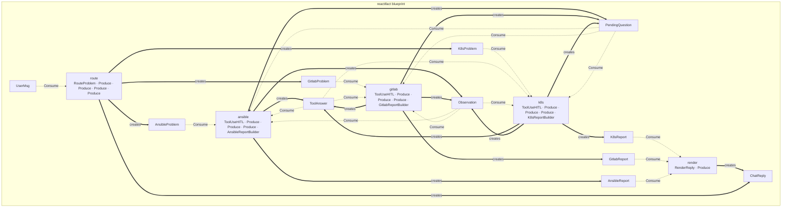

# devops — HITL tool agent (ops assistant)

An ops chat that routes a free-form complaint to a specialist agent (k8s /
GitLab / Ansible), each with its own tool and its own report builder. The
one domain twist: when an agent is mid-investigation and needs a value the
user never gave (a namespace, a project, a role), it asks — `effects.ask(...)`
→ `PendingQuestion` — and the *next* user message resumes that question
instead of starting a new problem (`create_message` in `web.py`/`chat.py`
checks for a pending question first). `HITLLMAgent` + `ToolUseHITL` do the
reactive ask/resume loop; routing itself is a separate structured LLM step
(`StructuredLLM`), not folded into a specialist's own prompt.

## Structure

```
devops/
├── chat.py           # CLI entry (build_resources, terminal loop)
├── web.py            # FastAPI/SSE app + trace dashboard (create_trace_router)
├── models.py         # artifact types (UserMsg, *Problem, *Report, ChatReply)
├── agents.py         # thin containers: RouteAgent, K8sAgent, GitlabAgent,
│                      #   AnsibleAgent (HITLLMAgent), RenderAgent
├── tools.py           # fake tools (kubectl_get, gitlab_search/pipeline,
│                      #   ansible_run) — simulated output, no real systems
├── guardrails.py      # trust & safety: custom guardrails + the ops policy
├── safety.py          # runnable guardrail demo (no LLM/network)
├── online_eval.py     # online-eval: score served runs + the ops evaluators
├── prompts.py         # per-specialist system prompts
├── produce/
│   ├── router.py      #   UserMsg → the right *Problem (structured routing)
│   ├── reports.py      #   K8s/Gitlab/AnsibleReportBuilder — tool loop → *Report
│   └── reply.py        #   *Report → ChatReply (render step)
└── web/index.html     # UI
```

## Run

```bash
.venv/bin/python examples/devops/web.py      # SSE UI + trace dashboard on :8000
.venv/bin/python examples/devops/chat.py     # interactive CLI
.venv/bin/python examples/devops/safety.py   # guardrails demo (no LLM needed)
.venv/bin/python examples/devops/online_eval.py  # online-eval demo (no LLM needed)
```

Without an LLM key the tool router and specialists fall back to deterministic
demo behavior; with a key (in `.env`) routing and report generation go through
the configured provider — the tools themselves are always simulated (see
`tools.py`'s own docstring: no real Kubernetes/GitLab/Ansible is ever
touched, by design, so the demo is safe to run against nothing).

Try: `pods are crashlooping in prod` — routes to the k8s agent, which asks
for the namespace before calling `kubectl_get` (mandatory tool parameters
are exactly what forces the clarifying question, HITL `type:"ask"`).

## How it flows — no graph to draw

Each agent declares what it `consumes`/`produces`; the runtime derives
execution from state changes.


The picture above walks the HITL ask/resume path through the `k8s` agent.
This is the actual static map of all 5 agents in this demo
(`python -m reactifact graph examples.devops.agents`):



Each specialist (`k8s`/`gitlab`/`ansible`) consumes its own `*Problem` type
*and* `ToolAnswer`/`Observation`/`PendingQuestion` — the self-consume that
lets `HITLLMAgent`'s reactive ask/resume loop keep running without the
specialist declaring that wiring itself (see `reactifact/llm_agent.py`).
`render` fans in every `*Report` type into one `ChatReply`; a mandatory tool
parameter that the router never captured is what forces the ask in the first
place, not a manual "if missing, ask" branch anywhere in this demo's own code.

## Trust & safety — custom guardrails

The ops assistant is a good place for guardrails: users ask for dangerous
things, and the artifacts that carry their request are typed, so a rule is
plain Python. `guardrails.py` defines a **custom** one — a destructive change
to production must cite a change ticket:

```python
from dataclasses import dataclass
from typing import Any
from reactifact import Context
from reactifact.guardrails import GuardrailDecision


@dataclass
class ProductionChangeGuardrail:
    name: str = "production_change"

    def check(self, data: Any, context: Context) -> GuardrailDecision:
        text = getattr(data, "text", "")
        if not (DESTRUCTIVE.search(text) and PROD.search(text)):
            return GuardrailDecision(guardrail=self.name)
        if TICKET.search(text):                       # approved change
            return GuardrailDecision(guardrail=self.name)
        return GuardrailDecision(                        # defer to the policy
            action="violation",
            reason="destructive change to production requires a CHG-… ticket",
            guardrail=self.name,
        )
```

A guardrail is just `name` + `check(data, context)`. Returning `violation`
defers the verdict to the policy (`on_violation="block"` raises
`GuardrailViolation`, `"flag"` records a metric and lets it through); returning
`redact` rewrites the data (see `SecretRedactionGuardrail`). The policy mixes
custom and built-in guardrails and is wired in one line — `chat.py` and
`web.py` both do this:

```python
resources = RuntimeResources(llm=llm, guardrails=devops_guardrail_policy())
```

Guardrails run on *produced* artifacts; `web.py`'s `create_message` screens the
raw input too (`screen(policy, ctx, text)`) so an unsafe request is refused
before routing. Run `python examples/devops/safety.py` to see all of it —
custom decision, redaction, an end-to-end block, and the flag metric — with no
LLM or network. The full reference is in
[docs/en/safety.md](../../docs/en/safety.md).

## Online evaluation

The trace dashboard stores every run, so the assistant can **score its own
traffic**. `online_eval.py` defines two trace-level evaluators (no `Context`
needed — a trace is truncated) and wires `reactifact.eval.online` to the same
store:

```python
def routed() -> Evaluator:            # produced a specialist problem or a reply
    def evaluate(eval_input: EvalInput) -> float:
        written = eval_input.outputs.get("artifacts", {})
        return 1.0 if set(written) & {"K8sProblem", "GitlabProblem",
                                      "AnsibleProblem", "ChatReply"} else 0.0
    evaluate.__name__ = "routed"
    return evaluate
```

`web.py` mounts `create_online_eval_router(build_evaluator(trace_store))`, so
`POST /api/evals/run` samples the latest runs, scores them and tags passes
`eval` / failures `eval:failed` — findable in the traces table next to the run.
For exact scoring (LLM judges over full text) pass `context_source(run_fn)`
instead of the default `trace_source()`; for sampling and cost, set
`sample_rate`/`limit` and wrap the provider in `CachingLLM`.

```bash
python examples/devops/online_eval.py          # offline demo, shows tags
reactifact eval examples/devops/traces.db      # score a real store from the CLI
```

## Trace dashboard

`web.py` mounts `create_trace_router` next to the chat router — every run's
agent spans, tool calls and LLM usage are inspectable at `/traces` without
any external service (see [docs/en/observability.md](../../docs/en/observability.md)).
